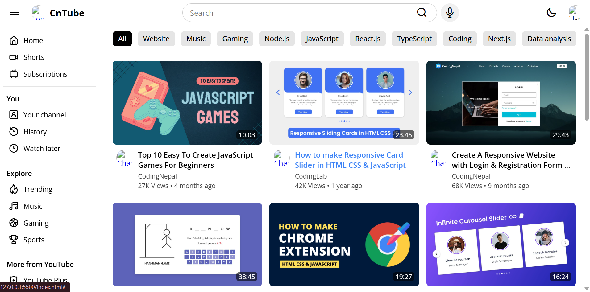
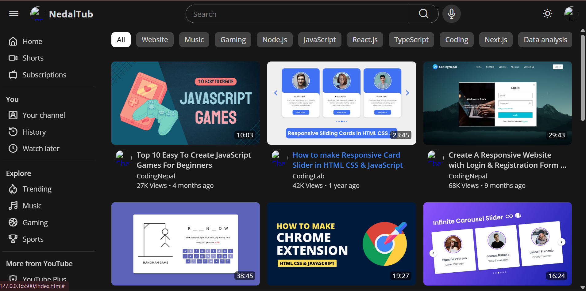

# 🎬 YouTube Clone - NedalTub (Frontend + PHP Backend)

A clean, responsive YouTube-inspired video platform built with **HTML**, **CSS**, **Bootstrap**, and **JavaScript**. The backend (in progress) will be built using **PHP** and MySQL.

> ✍️ **Edited and developed by Nidal Hasnaoui**

---

## 📌 Features

### ✅ Frontend (Completed)
- Sidebar navigation (Home, Shorts, Subscriptions, etc.)
- Light & dark mode toggle
- Fully responsive layout using Bootstrap
- Search bar and tag filters (e.g., JavaScript, Gaming, React.js...)
- Video card layout with duration, views, title, and channel

### 🔧 Backend (Coming Soon)
- PHP video upload functionality
- User authentication system (login/register)
- MySQL database for users and videos
- Comments, likes, categories, and watch later

---

## 🧠 Tech Stack

- HTML5  
- CSS3  
- Bootstrap 5  
- JavaScript (Vanilla)  
- PHP (Planned backend)  
- MySQL (Planned database)

---

## 📸 Screenshots

### ☀️ Light Mode  


### 🌙 Dark Mode  


> *These screenshots show the UI built using frontend code only.*

---

## 🚀 How to Run This Project

1. Clone the repository:

```bash
git clone https://github.com/yourusername/youtube-clone.git
cd youtube-clone
